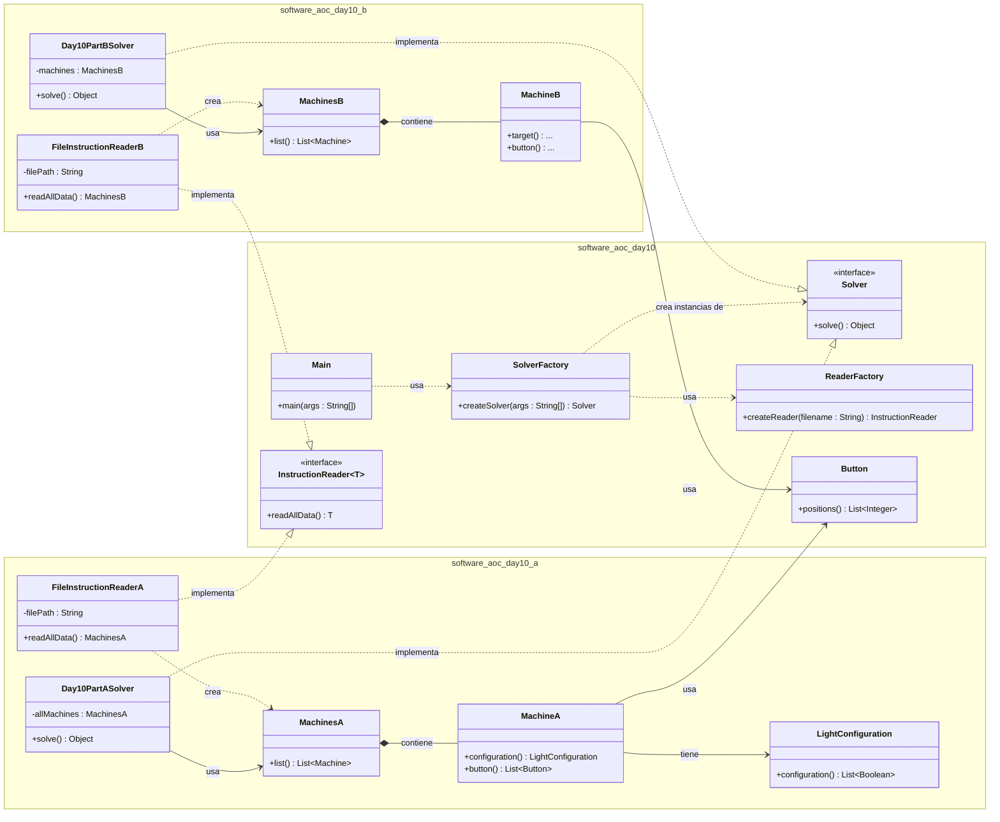

# Advent of Code 2025 - Day 10

Este proyecto resuelve el desafío del Día 10 de Advent of Code 2025 implementando una arquitectura robusta basada en **SOLID**, **Clean Code** y **Patrones de Diseño** (Factory y Strategy).

## Arquitectura del Proyecto

El código se ha refactorizado para soportar múltiples estrategias de resolución manteniendo una base común limpia.

### Diagrama de Clases Simplificado

### Estructura de Paquetes

- `software.aoc.day10`: **Núcleo Común**. Contiene las interfaces (`Solver`, `InstructionReader`), las Factorías (`SolverFactory`, `ReaderFactory`) y el punto de entrada (`Main`).
- `software.aoc.day10.a`: **Estrategia A**. Implementación específica para la Parte 1 (Lógica, Modelos y Parsers).
- `software.aoc.day10.b`: **Estrategia B**. Implementación específica para la Parte 2.

## Patrones y Principios Aplicados

### 1. Strategy Pattern

El `Main` no conoce la implementación concreta de la solución. Simplemente pide una estrategia ("A" o "B") y la ejecuta a través de la interfaz común `Solver`. Esto permite cambiar el comportamiento en tiempo de ejecución (o configuración) sin modificar el código cliente.

### 2. Factory Pattern

`SolverFactory` y `ReaderFactory` encapsulan la complejidad de instanciar los objetos correctos. Dependiendo del parámetro `type` ("A" o "B"), fabrican la cadena de dependencias correcta (Solver A con Reader A y Modelos A, o Solver B con Reader B y Modelos B).

### 3. Dependency Injection (DIP)

Los `Solver` no instancian sus lectores de datos. Reciben una instancia de `InstructionReader` a través de su constructor. Esto desacopla la lógica de negocio de la fuente de datos.

### 4. Interface Segregation (ISP) y Generics

Se ha utilizado una interfaz `InstructionReader<T>` genérica para permitir que cada parte del problema devuelva sus propias estructuras de datos (`MachinesA` o `MachinesB`) manteniendo un contrato común.
