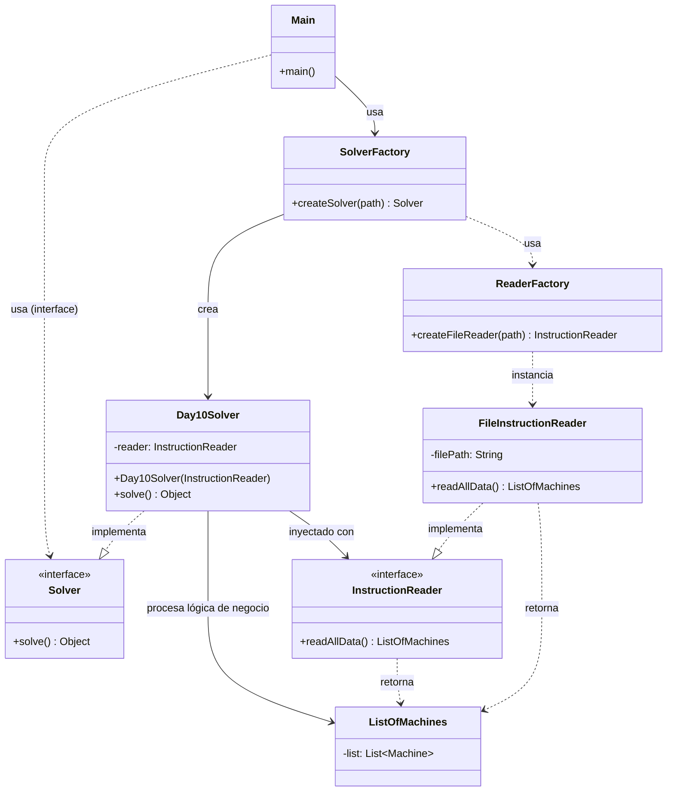

# Advent of Code 2025 - Day 10: Factory

## Descripción del Problema

El desafío consiste en configurar máquinas en una fábrica para alcanzar niveles de voltaje específicos ("joltage") presionando una serie de botones. Se nos proporciona una configuración para cada máquina: cómo afectan los botones A y B a las coordenadas X e Y, y la ubicación del premio (coordenas objetivo).

- **Objetivo:** Calcular el **húmero mínimo de tokens** (o pulsaciones totales) para alinear los contadores internos de cada máquina con sus requisitos de voltaje específicos.
- **Modelo Matemático:** Esto se modela como un sistema de ecuaciones lineales donde buscamos soluciones enteras no negativas que minimicen el coste.

## Arquitectura del Proyecto

El proyecto sigue una arquitectura modular estricta basada en principios SOLID y patrones de diseño. A continuación se muestra el diagrama de clases que rige la solución:

## Estructura de Paquetes

- `software.aoc.day10`: Contiene las interfaces comunes (`Solver`, `InstructionReader`) y las factorías (`SolverFactory`, `ReaderFactory`).
- `software.aoc.day10.b`: Implementación específica de la solución (`Day10Solver`, `FileInstructionReader`) y dominio (`Machine`, `Button`, `ListOfMachines`).

## Análisis de Calidad de Software (SOLID & Patrones)

### 1. Principios SOLID

#### S - Single Responsibility Principle (SRP)

Cada clase tiene una responsabilidad única y bien definida:

- `InstructionReader`: Solo se preocupa de obtener y parsear los datos del archivo.
- `Day10Solver`: Orquesta la resolución del problema matemático (sistemas lineales) usando los datos.
- `ListOfMachines`: Encapsula la colección de datos de dominio.
- `Factories`: Encapsulan la complejidad de la creación de objetos y dependencias.

#### O - Open/Closed Principle (OCP)

El sistema está abierto a la extensión pero cerrado a la modificación. Nuevas formas de leer datos pueden añadirse creando nuevos `InstructionReader` sin modificar el `Solver`. Nuevos algoritmos para el Día 10 pueden implementarse creando nuevos `Solver`.

#### L - Liskov Substitution Principle (LSP)

Las implementaciones de `Solver` e `InstructionReader` son intercambiables sin romper la lógica del cliente (`Main`). `Day10Solver` puede ser sustituido por cualquier otra implementación de `Solver`.

#### I - Interface Segregation Principle (ISP)

Las interfaces `Solver` e `InstructionReader` son concisas y especifican solo lo necesario para la ejecución y lectura de datos.

#### D - Dependency Inversion Principle (DIP)

El código de alto nivel (`Main`, `Solver`) depende de abstracciones (`Solver` interface, `InstructionReader` interface), no de implementaciones concretas. La inyección de dependencias se realiza a través del constructor del `Day10Solver`.

### 2. Patrones de Diseño

- **Factory Pattern**: Se utilizan `SolverFactory` y `ReaderFactory` para centralizar la creación de objetos complejos y ocultar la lógica de instanciación al cliente (`Main`).
- **Strategy Pattern**: La interfaz `Solver` actúa como una estrategia, permitiendo que `Main` ejecute la implementación de resolución (`Day10Solver`) de manera abstracta.
- **Dependency Injection**: El `Reader` se inyecta en el `Solver`, permitiendo desacoplar la obtención de datos de su procesamiento matemático.
